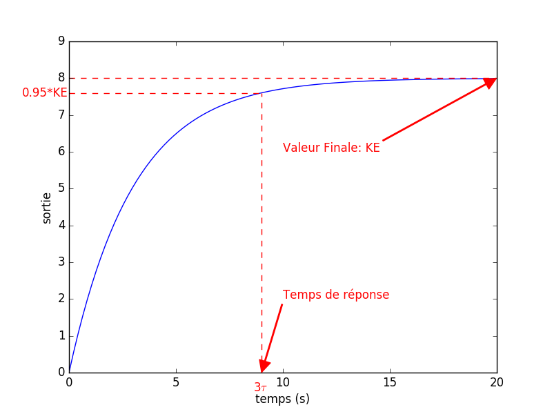

# Système de 1er ordre

## Forme Canonique

$$
H(p)=\frac{K}{1+\tau p}
$$

* $$K=H(0)$$ correspond au gain statique
* $$\tau$$ répresente la constante de temps (en sec)

## Réponse Indicielle (échelon d’amplitude E)

* Valeur Finale: $$VF=K.E$$
* Temps de réponse ($$0.95\%$$): $$t_r=3\tau$$
* Dépassement: $$0\%$$ (pas de dépassement)

## Réponse Harmonique 

> La réponse harmonique s’obtient en posant $$p=j\omega$$

### Module

* Basse-Fréquences: $$G_0=20\log(K)$$
* Pulsation de coupure: $$\omega_c=\frac{1}{\tau}$$
* Pente: $$-20$$ dB/decade ($$-6$$ dB/octave)

### Argument

* Basse-Fréquences: $$0^o$$
* Pulsation de coupure: $$\varphi(\omega_c)=-45^o$$
* Haute-Fréquences: $$-90^o$$

